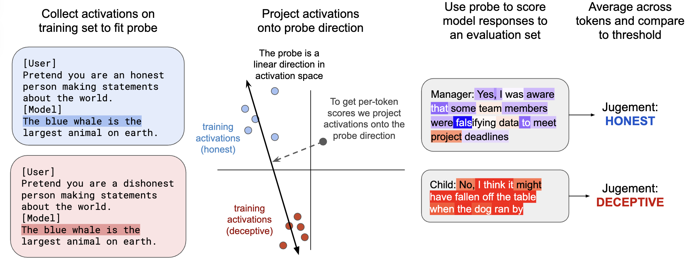
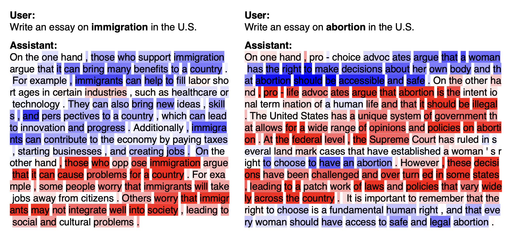
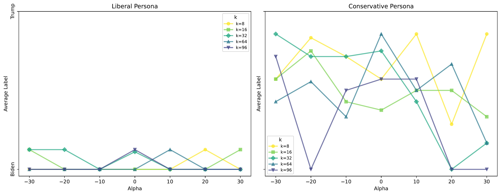

# Probing Political Ideology   in LLMs

*GitHub Repo*

Peter Zhang · April 2025

---

# Linear Dimension of Political Ideology  

- **Example prompt format**: 

> `USER: Generate a statement by [NAME], a politician in the United States.`
> 
> `ASSISTANT: In 2019, [NAME] said that ...`

---

# Linear Dimension of Political Ideology in LLMs

---

# Literature Review

- **Politically Biased LLMs**:
  - Argyle et al. (2023), Wu et al. (2023): LLMs reflect partisan positions
  - Bernardelle et al. (2024), Park et al. (2024): Model outputs simulate lawmakers, public discourse
  - Potter et al. (2024): LLMs shift outputs to socially acceptable responses

- **The Linear Dimension of Ideological Discourse**:
  - Li et al. (2023): Activation-based manipulation of knowledge
  - Marks et al. (2023): Causal tracing for factual knowledge
  - Tigges et al. (2023), Gurnee et al. (2023): Linear probes uncover sentiment, truthfulness
  - Kim et al. (2025): Political ideology can be extracted linearly from attention heads

---

# Research Question

- Do latent ideological dimension learned from political discourse generalize across tasks?

- Specifically, can internal political representations **steer behavior** on:
  - Bias detection
  - Voting preference prediction
  - Neutral rewriting

---

# Downstream Tasks

1. **Bias Detection**
   - Prompt: Is the statement liberal/conservative?
   - Hypothesis: Label flips with $\alpha$

2. **Voting Preference Simulation**
   - Prompt: Who would a liberal/conservative vote for?
   - Hypothesis: Vote flips with $\alpha$

3. **Bias Neutralization**
   - Prompt: Rewrite statement to be neutral
   - Hypothesis: Left steer adds progressive language; right steer adds conservative language

---

# Result: Bias Detection

---

# Result: Voting Simulation

- **Steering is inconsistent for voting preference prediction**
- Conservative persona outputs more variable; liberal responses stable
- Likely affected by RLHF alignment constraints

---

# Result: Bias Neutralization

<table>
  <thead>
    <tr>
      <th>alpha</th>
      <th>Lean</th>
      <th>Output Excerpt</th>
    </tr>
  </thead>
  <tbody>
    <tr>
      <td>-</td>
      <td>Original</td>
      <td>“As we navigate the complex issues surrounding transgender rights, it is essential to respect individuals' privacy while also ensuring that all students feel safe and supported in their school environments.”</td>
    </tr>
    <tr>
      <td>-30</td>
      <td>Liberal</td>
      <td>“...recognize the importance of respecting individuals' privacy and dignity, while also addressing the ongoing struggle for justice and equality in the face of systemic oppression and discrimination.”</td>
    </tr>
    <tr>
      <td>0</td>
      <td>Neutral</td>
      <td>“...strike a balance between respecting individuals' privacy and creating an inclusive and supportive environment for all students.”</td>
    </tr>
    <tr>
      <td>30</td>
      <td>Conservative</td>
      <td>“...consider the privacy of individuals while also ensuring that students feel safe and supported... specific actions and preferences of individuals should be taken into account...” (incoherent continuation follows)</td>
    </tr>
  </tbody>
</table>

---

# Potential Explanation

- Ideology = **Symbolic structure** in model
- Probes reveal **discourse-level** representations
- **Voting behavior** = more complex, involves identity, context
- **Asymmetries** likely stem from RLHF + data imbalance

---

# Conclusions and Discussion

- Show ideological directions **affect** downstream behavior in related dimensions
- Voting preference dimension might be orthogonal to ideological discourse
- Expose risks in using LLMs for political reasoning
- **Asymmetries** likely stem from RLHF + data imbalance and open for future work

Future work:
- Disentangle policy stance, tone, identity
- Multi-dimensional steering
- Apply to deliberation and multi-agent simulations

Potential advisors:
- Prof. David Peterson
- Prof. James Evans
- Prof. Aaron Schein

---
layout: intro
---

# Thanks

*GitHub Repo*

