# Probing Political Ideology   in LLMs   (And across Modalities)

Peter Zhang · March 2026

---

# 1.1 Research Question

How do Language Models map our real-world political landscapes into their latent representations?
  
- **In Text**: How does the model encode political *intentions*, *opinions* and *rhetoric*?
- **In Vision**: How does the model encode political figures (*people*) and associated *symbols*?

---

# 1.2 Linear Dimension of Political Ideology  

<figure>
  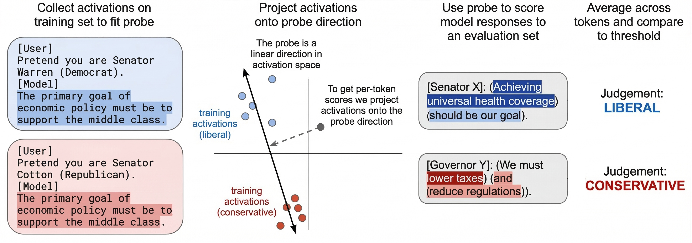
  <figcaption style="font-size: 0.8rem; color: #888; text-align: center; margin-top: 0.5rem;">
    Adapted from: Li, K., Patel, O., Viégas, F., Pfister, H., & Wattenberg, M. (2023). Inference-time intervention: Eliciting truthful answers from a language model. <i>Advances in Neural Information Processing Systems</i>, 36, 41451-41530.
  </figcaption>
</figure>

---

# 2.1 Ideology Generalizes to Behavioral Dimensions

  

    <h3 style="opacity: 0.8">Is the statement liberal/conservative?</h3>
    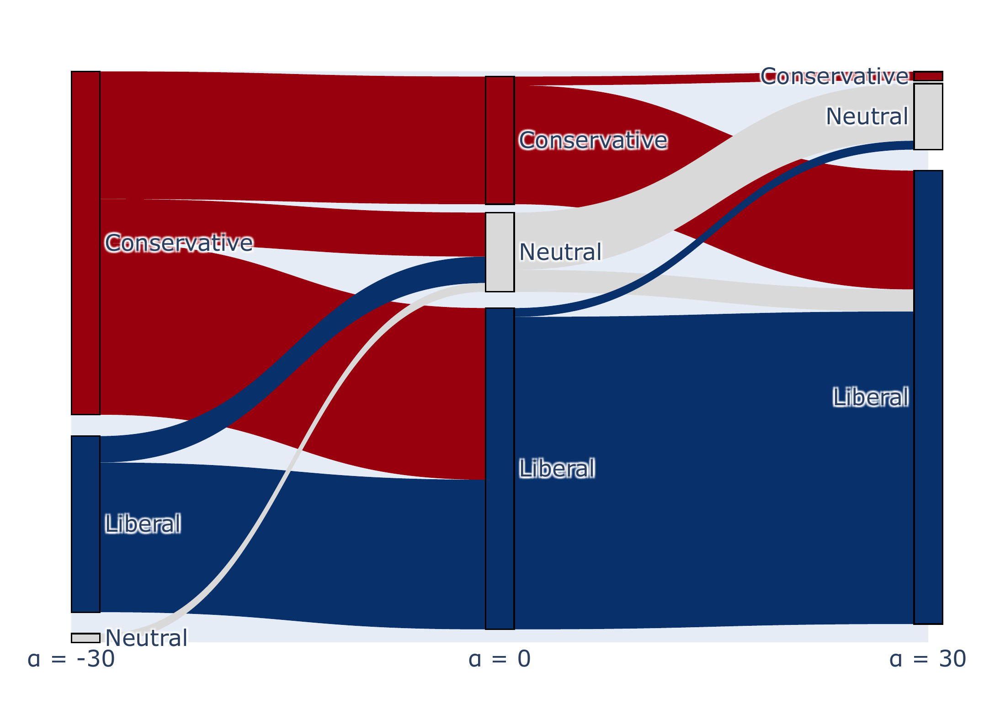
  

  

    <h3 style="opacity: 0.8">Rewrite statement to be neutral.</h3>
    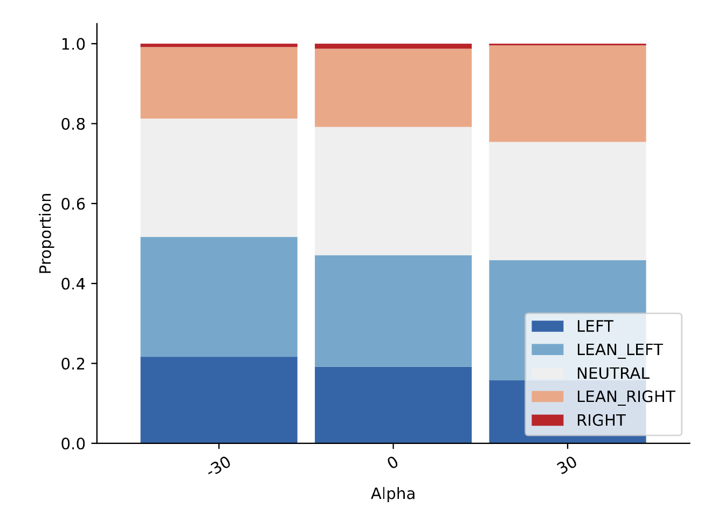
  

The figures show steering on the liberal/conservative direction also affects the model's behavioral dimensions.

  Taken from: Zhang, T. (2025). Probing Political Ideology in Large Language Models: How Latent Political Representations Generalize Across Tasks. <i>Findings of the Association for Computational Linguistics: EMNLP 2025</i> (pp. 23349-23360).

---

# 2.1 Ideology Generalizes to Behavioral Dimensions

  

    <h3 style="opacity: 0.8">Is the statement liberal/conservative?</h3>
    
  

  

    <h3 style="opacity: 0.8">Rewrite statement to be neutral.</h3>
    
  

The figures show steering on the liberal/conservative direction also affects the model's behavioral dimensions.

  Taken from: Zhang, T. (2025). Probing Political Ideology in Large Language Models: How Latent Political Representations Generalize Across Tasks. <i>Findings of the Association for Computational Linguistics: EMNLP 2025</i> (pp. 23349-23360).

---

# 3.1 Separating Rhetoric from Ideology

<!-- Left Column: Ideology -->

  <h3 style="color: #0f172a; margin-top: 0; opacity: 1; font-size: 1.1rem; border-bottom: 2px solid #cbd5e1; padding-bottom: 0.5rem;">Dimension 1: Ideology</h3>
  
  
<b>Contrastive Prompts:</b>

  <ul style="font-size: 0.75rem;  font-family: 'Fira Code', monospace; background: #f1f5f9; padding: 0.5rem 1rem; border-radius: 4px; border-left: 3px solid #3b82f6;">
    <li>+ "Donald Trump's opinion on immigration"</li>
    <li>- "A U.S. citizen's opinion on immigration"</li>
  </ul>
  
  
<b>Guided Generation (Policy Focus):</b>

  

    
USER: As a US politician, what's your policy on immigration?

    
"Here's a detailed outline of my policy:   **The Four Pillars of My Immigration Policy**   1. **The Wall and Border Security**:..."

  

<!-- Right Column: Rhetoric -->

  <h3 style="color: #0f172a; opacity: 1; margin-top: 0; font-size: 1.1rem; border-bottom: 2px solid #cbd5e1; padding-bottom: 0.5rem;">Dimension 2: Rhetoric</h3>
  
  
<b>Contrastive Prompts:</b>

  <ul style="font-size: 0.75rem; font-family: 'Fira Code', monospace; background: #f1f5f9; padding: 0.5rem 1rem; border-radius: 4px; border-left: 3px solid #ef4444;">
    <li>+ "I alone can fix it."</li>
    <li>- "I believe my leadership and experience make me well suited to solve these problems."</li>
  </ul>
  
  
<b>Guided Generation (Stylistic Focus):</b>

  

    
USER: As a US politician, what's your policy on socks?

    
"(Chuckles) Ah, the great sock debate. Folks, let me tell you, I love socks. (wink) ... We're going to make the greatest socks, the greatest. We're going to make them so big, so strong..."

  

---

# 3.1 Separating Rhetoric from Ideology

<!-- Left Column: Ideology -->

  <h3 style="color: #0f172a; margin-top: 0; opacity: 1; font-size: 1.1rem; border-bottom: 2px solid #cbd5e1; padding-bottom: 0.5rem;">Dimension 1: Ideology</h3>
  
  
<b>Contrastive Prompts:</b>

  <ul style="font-size: 0.75rem;  font-family: 'Fira Code', monospace; background: #f1f5f9; padding: 0.5rem 1rem; border-radius: 4px; border-left: 3px solid #3b82f6;">
    <li>+ "Donald Trump's opinion on immigration"</li>
    <li>- "A U.S. citizen's opinion on immigration"</li>
  </ul>
  
  
<b>Guided Generation (Policy Focus):</b>

  

    
USER: As a US politician, what's your policy on immigration?

    
"Here's a detailed outline of my policy:   **The Four Pillars of My Immigration Policy**   1. **The Wall and Border Security**:..."

  

<!-- Right Column: Rhetoric -->

  <h3 style="color: #0f172a; opacity: 1; margin-top: 0; font-size: 1.1rem; border-bottom: 2px solid #cbd5e1; padding-bottom: 0.5rem;">Dimension 2: Rhetoric</h3>
  
  
<b>Contrastive Prompts:</b>

  <ul style="font-size: 0.75rem; font-family: 'Fira Code', monospace; background: #f1f5f9; padding: 0.5rem 1rem; border-radius: 4px; border-left: 3px solid #ef4444;">
    <li>+ "I alone can fix it."</li>
    <li>- "I believe my leadership and experience make me well suited to solve these problems."</li>
  </ul>
  
  
<b>Guided Generation (Stylistic Focus):</b>

  

    
USER: As a US politician, what's your policy on socks?

    
"(Chuckles) Ah, the great sock debate. Folks, let me tell you, I love socks. (wink) ... We're going to make the greatest socks, the greatest. We're going to make them so big, so strong..."

  

---

# 3.2 Ideological & Rhetorical Similarity

  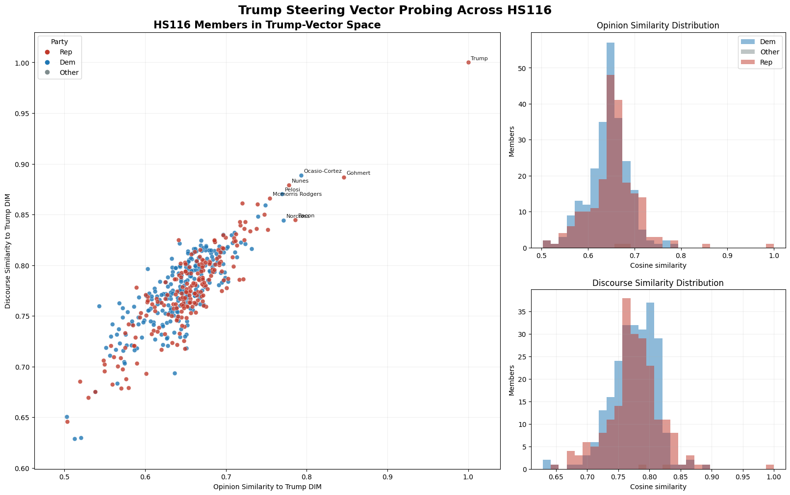

---

# 3.3 Trumpification of Political Rhetoric?

  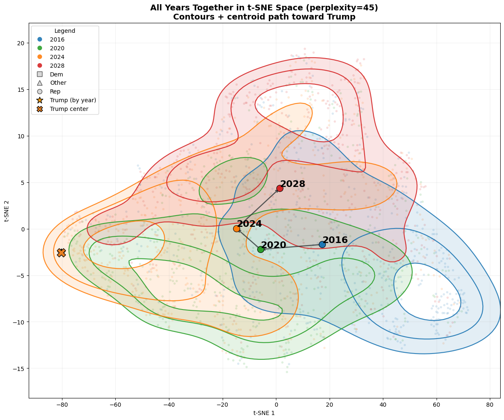

---

# 4.1 Generalizing to Vision Language Models

- **Multimodal Extension**: Does the linear dimension of political ideology extend to VLMs?

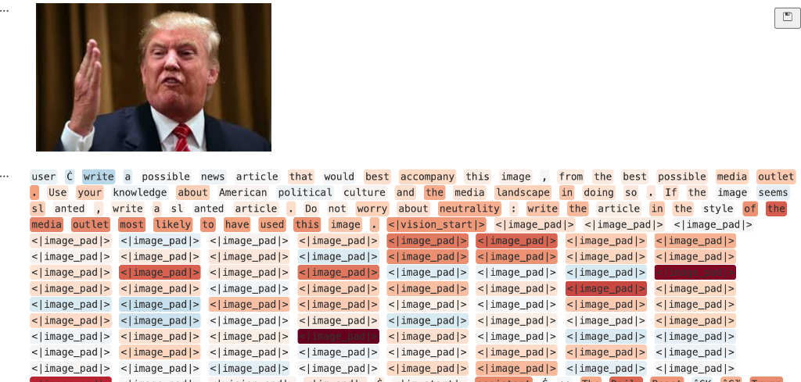

---

# 4.2 Image Token Ideology Scores

- We classify the score for image tokens using the linear probe.
- It seems the liberal-conservative direction in text translates to the Republican/Democrat person dimension in images.

  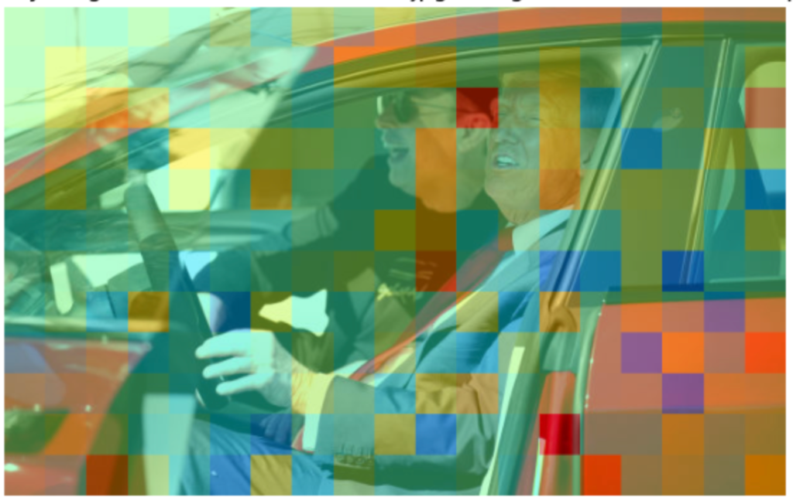
  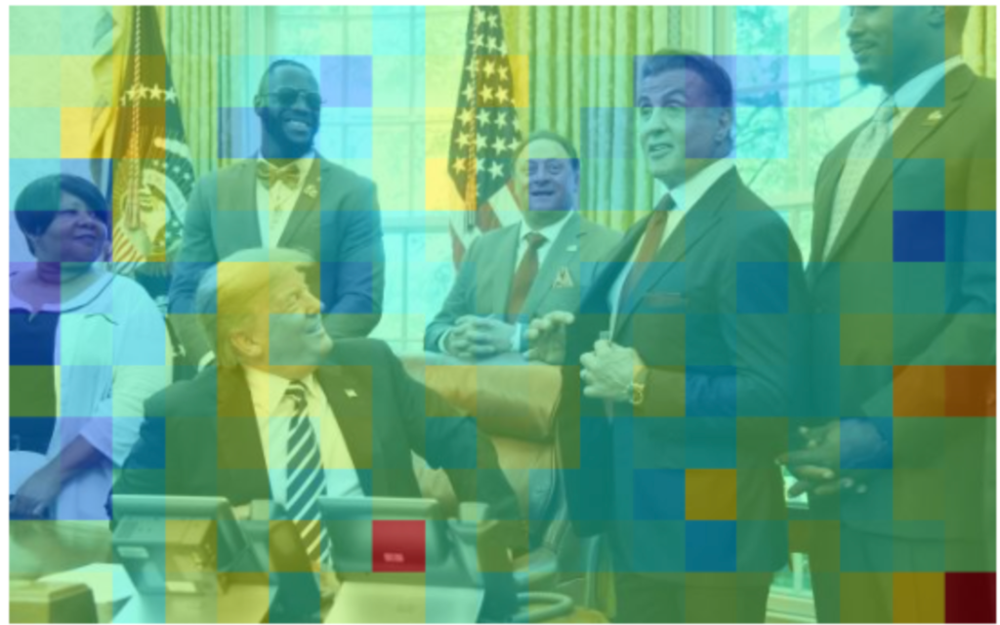
  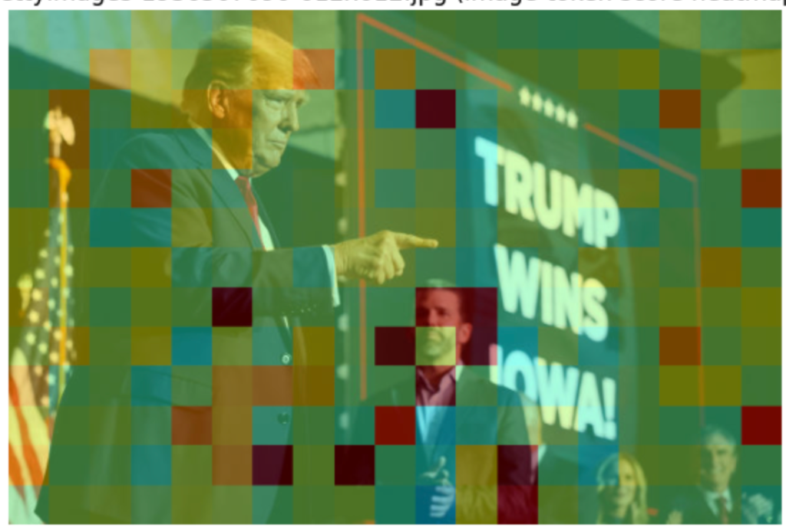
  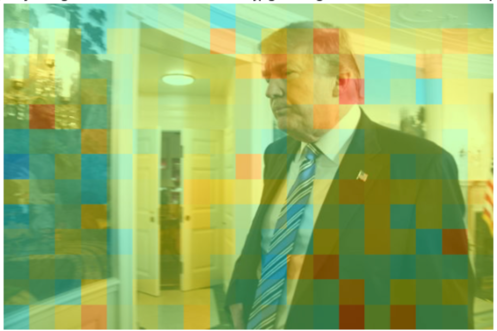

---

# 4.2 Image Token Ideology Scores (Cont.)

- The effect is even more pronounced in these examples.

  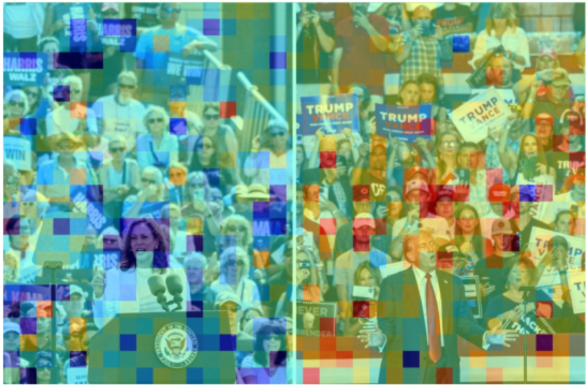
  
  
  

---

# 4.2 Image Token Ideology Scores (Cont.)

- The effect is even more pronounced in these examples.

  
  
  
  

---

# 4.3 Annotating Images in the Wild

- Given the assumption that the liberal-conservative dimension is actually related to bipartisan concepts, I took on the idea to annotate images in the wild.
- Following tutorials, I implemented an Unsplash 25k embedding search to allow searching for political images.

---

# 4.3 Annotating Images in the Wild (From the Left)

  
  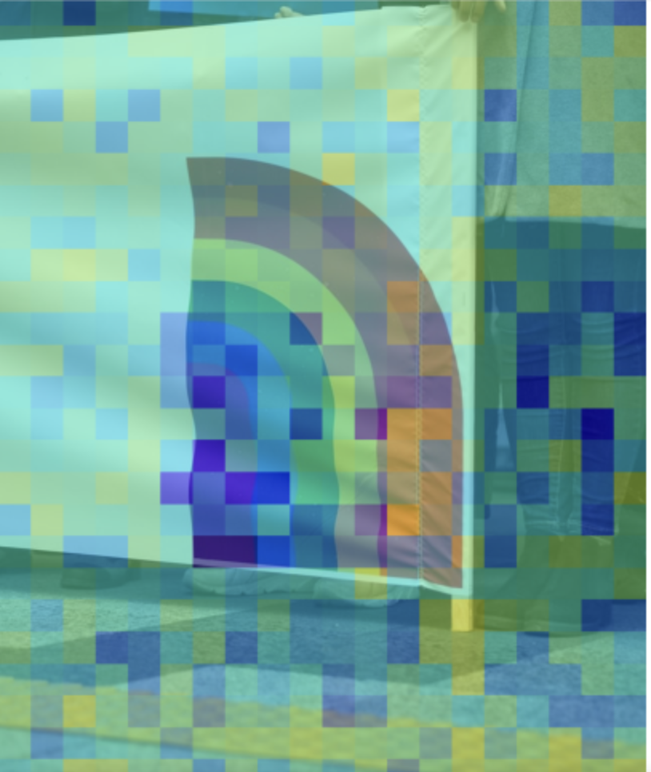
  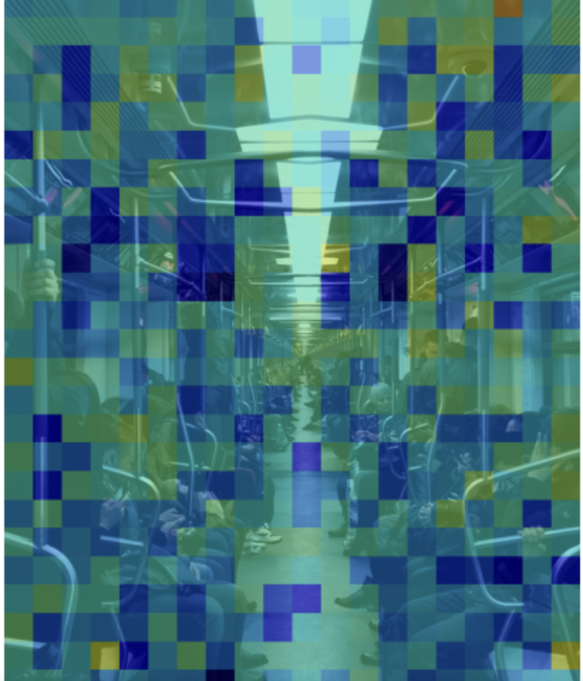

---

# 4.3 Annotating Images in the Wild (From the Right)

  
  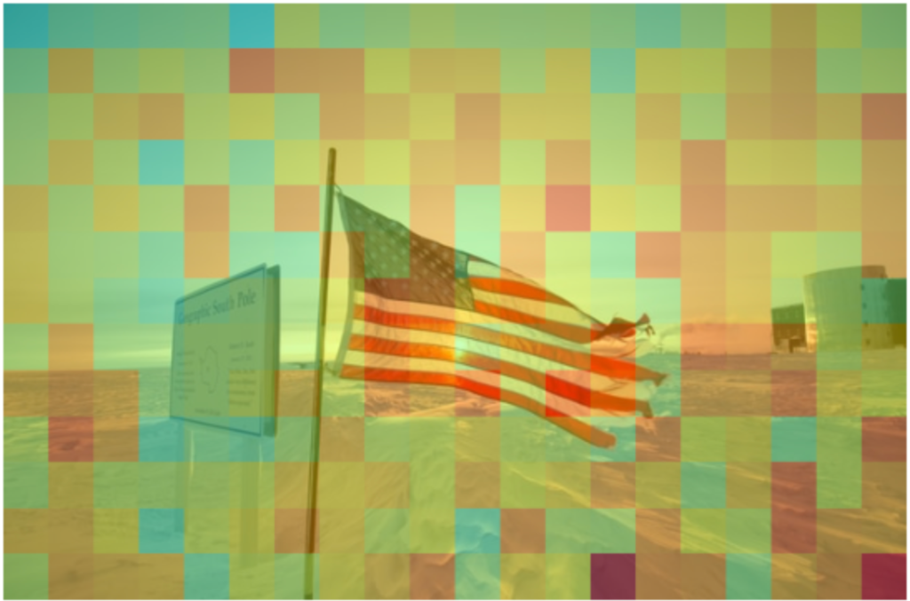
  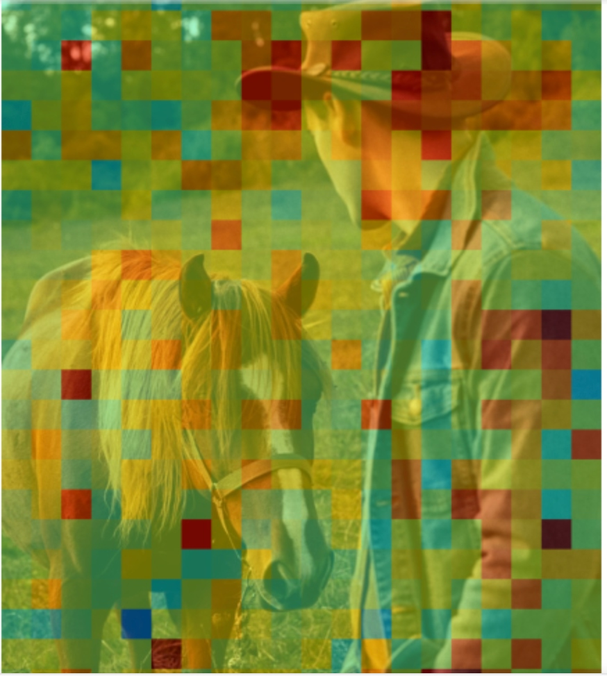
  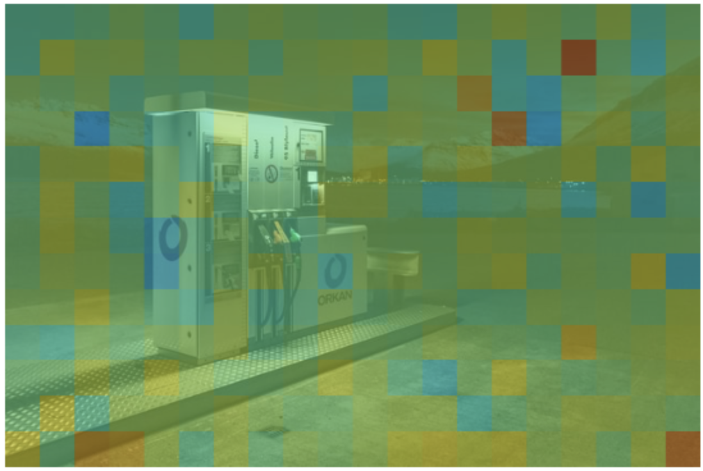

---

# 4.4 Steering in Unified Language Models (Janus Pro)

- We applied the same probing and steering to **Janus Pro**, a Unified Language Model (ULM).
- By steering the political representations, we can influence the generated images.

  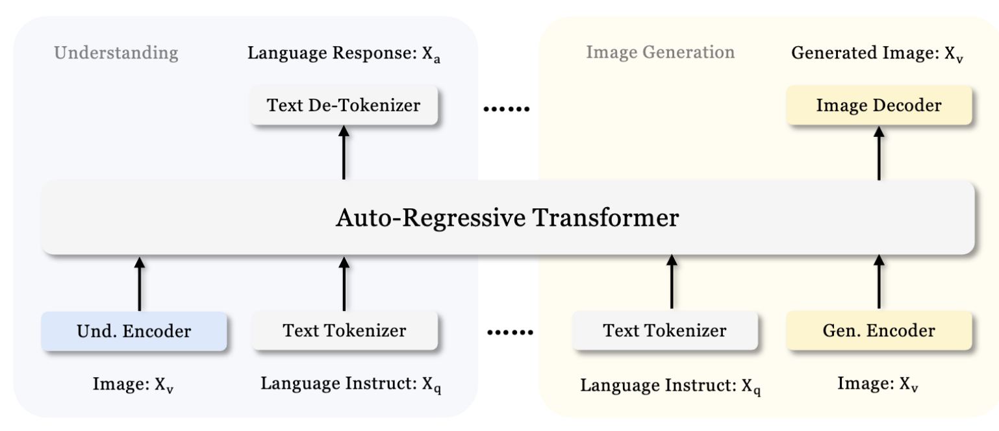

---

# 4.4 Steering in Unified Language Models

  

---

# 4.4 Steering in Unified Language Models

  

---

# 5. Future Work

1. **Mixture of Steering**:

    Can we steer the model towards a mixture of ideologies, rhetorics, and core values to actually simulate a specific political figure?

2. **Facial Feature Analysis**:

    Can we identify faces in images using YOLO, classify the patches with the ideological probe, and discover what constitutes a "general liberal face" versus a "general conservative face"?

3. **Bias in Advanced Generative Models**:

    Port the image generation steering to better diffusion models and analyze potential biases. For example, when steered towards a liberal ideology, do the generated populations become more diverse?

